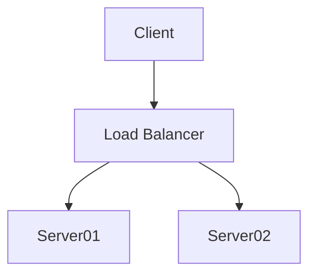

# Login Step By Step Tutorial 1
This is the basic version of a login for a website. This version is not secure, but it a basis for building a more secure version later on.

It consists of the following files:

## ClientSide1.html

This file shows the basic ```if ...``` statement used for a login. On this file it is written in JavaScript and runs on the client machine. As such it is in now way secure (the user can just view the sources code and so get the paswword!) however it emonstrates the coding structure we will use in PHP

## ServerSide1.html

This file creates a form to be submited to the ```ServerSideValidator.php``` file which checks the password

## ServerSideValidator.php

This checks the password submitted from the form on ServerSide1.html. If it is the same as the stored password then it send you on to the secure page (```ServerSide2.html```), otherwise it sends you back to the login page (```ServerSide1.html```)

## ServerSide2.html

The "secure" destination page

## Diagram
```
+------------------+
| ServerSide1.html | --Submit----+
+------------------+             |
         ^                       v
         |           +-------------------------+                          
         |           | ServerSideValidator.php |
         |           |                         |
         No ---------|Submitted PW = Stored PW?|
                     +-------------------------+                               
                                 |
                                Yes
+------------------+             |     
| ServerSide2.html | <-----------+
+------------------+

```


